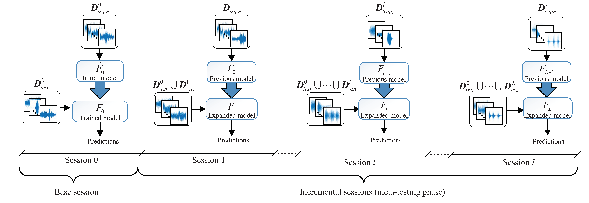
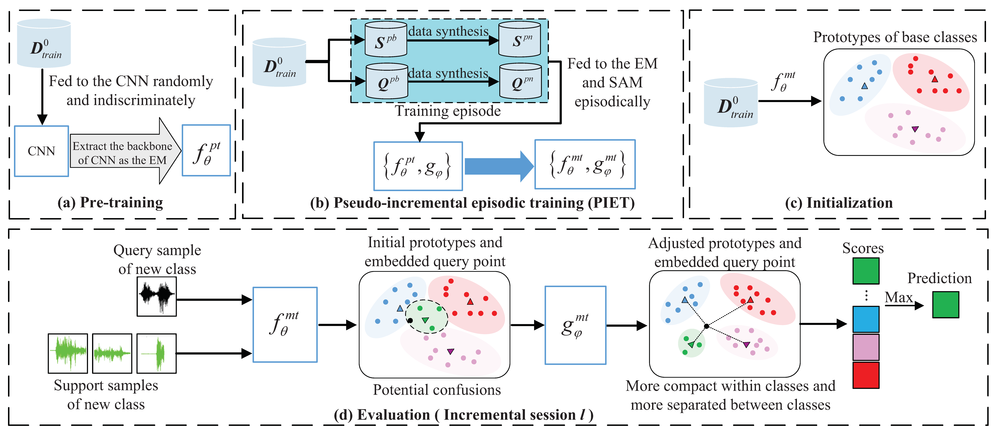

# [Few-shot class-incremental audio classification via discriminative prototype learning](https://www.sciencedirect.com/science/article/pii/S0957417423005468?via%3Dihub)

Official PyTorch implementation of **DPL**, from the following paper:

[Few-shot class-incremental audio classification via discriminative prototype learning](https://www.sciencedirect.com/science/article/pii/S0957417423005468?via%3Dihub). Expert Systems with Applications 2023.\
[Wei Xie](https://scholar.google.com/citations?hl=en&user=bOUL1r4AAAAJ), [Yanxiong Li](https://scholar.google.com/citations?user=ywDuJjEAAAAJ&hl=en), [Qianhua He](https://scholar.google.com/citations?user=xgI45kMAAAAJ&hl=en) and Wenchang Cao\
School of Electronic & Information Engineering, South China University of Technology


--- 


### The problem of Few-shot class-incremental audio classification
<div align="center">
  
</div>


### The method of discriminative prototype learning

<div align="center">
  
</div>


## 0. Requirements

[Conda]( https://conda.io/projects/conda/en/latest/user-guide/install/index.html?highlight=conda ) should be installed on the system.

* Install [Anaconda](https://www.anaconda.com/).

* Run the install dependencies script:
```bash
conda env create -f environment.yml
```
This creates conda environment ```FCAC``` with all the dependencies.

## Datasets

Please follow the instructions [here](https://github.com/chester-w-xie/FCAC_datasets) to prepare the NSynth-100 and FSC-89 datasets.

Please execute the following commands in your server terminal to perform dataset loading verification. This process will automatically extract the normalization statistics for each dataset. Ensure that the paths to the datasets are correctly configured:

```
python DatasetsManager_Nsynth100.py --metapath /SATA01/datasets/The_NSynth_Dataset \
--audiopath path to the The_NSynth_Dataset folder --num_class 100 --base_class 55

```

```
python DatasetsManager_FSC89.py --metapath /SATA01/datasets/FSD-MIX-CLIPS-for_FSCIL/FSD_MIX_CLIPS.annotations_revised/FSC-89-meta \
--datapath path to the FSD-MIX-CLIPS_data folder --data_type audio --setup mini
```

## Usage

For the experiments involving the DPL method on the Nsynth-100 dataset, please update the dataset path in the 'exp_Nsynth.sh' file before executing it:
```
sh exp_Nsynth.sh
```

For the experiments involving the DPL method on the FSC-89 dataset, please update the dataset path in the 'exp_FSC89.sh' file before executing it:

```
exp_FSC89.sh
```

## Main results

<div align="left">
  
</div>


## Acknowledgement
This repository is built using 
## License
This project is released under the MIT license. Please see the [LICENSE](LICENSE) file for more information.

## Citation
If you find this repository helpful, please consider citing:
```
@article{XIE2023120044,
title = {Few-shot class-incremental audio classification via discriminative prototype learning},
journal = {Expert Systems with Applications},
pages = {120044},
year = {2023},
issn = {0957-4174},
doi = {https://doi.org/10.1016/j.eswa.2023.120044},
url = {https://www.sciencedirect.com/science/article/pii/S0957417423005468},
author = {Wei Xie and Yanxiong Li and Qianhua He and Wenchang Cao},
}
```
